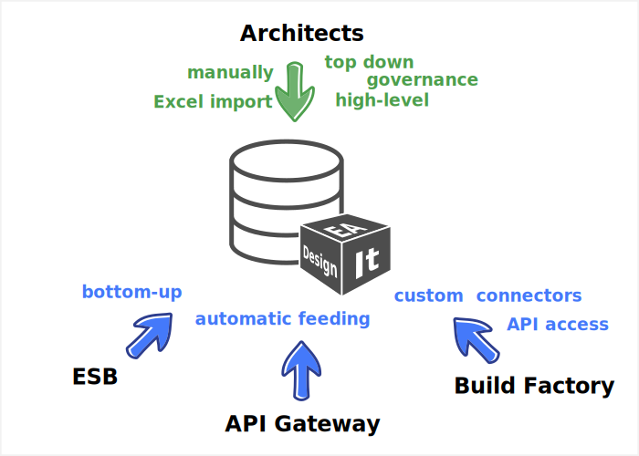
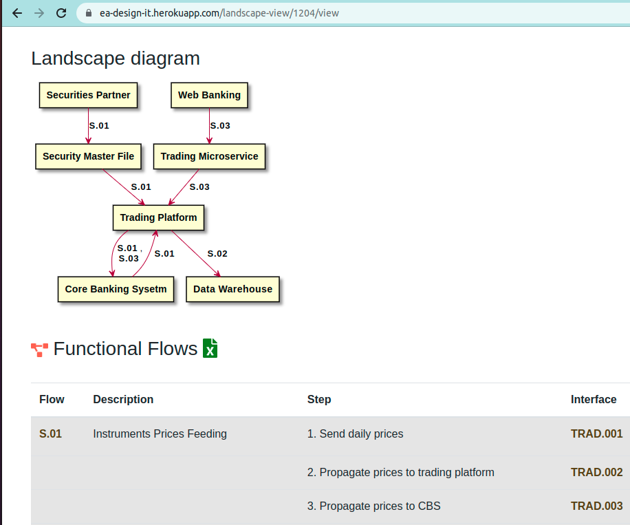

# EADesignIt

# Introduction

EADesignIt is lightweight and an open source Enterprise Architecture software that will allow you to create transaparency on your assets, their connections and their characteristics storing them in a database repository

EADesignIt aims Enterprise Architects who need to document the state of their enterprise, helping them to describe their applications landscape with a minimal effort, replacing unmaintanable Excel files.

EADesignIt help architects to document in a centralized repository their assets, including:

- Applications,
- Application Components
- Interfaces
- Data Flows
- Capabilities covered by Applications

Based on the observation that building an enterprise-wide assets repository is a costly activity and that maintaining a fine-grained refential manually could turn into a nightmare, the idea behind EADesignIt is to create via a manually process a top-down high-level repository and give the possibility to complete the feeding of the repository by any bottom-up tooling

For these reasons, note than event if it's then possible to create all entities (applications, interfaces, etc.) via the GUI, the philosophy of the software is to be open :

- importing and exporting excel files
- offering an API over the database to add your own process/tooling to populate the database

If you want to have a better idea, please browse the [demo](https://ea-design-it.herokuapp.com/) on Heroku platform

# Data model

If you want to know if EADesignIt is appropriate for your requirements, the more important aspect is the data model.

Does the data model meet your requirements? So for more explanation of potential features, please read first the [description of data model](./documentation/metamodel).

You can also import the [JDL file](./jhipster-jdl-metamodel.jdl) in [jdl studio](https://start.jhipster.tech/jdl-studio/) for a more accurate and detailed view of the entities and their relationships.

# Diagram or not diagram ?

This application is not a architeture diagram tool.
It should be considered as a databse referential first.

Diagram capabilities come however in two forms :

- generated diagram using [plantuml](http://www.plantuml.com)
- generated and updatable diagram using [drawio](https://drawio-app.com/)

Example of generated plantuml diagram :

Example of generated then modified draw.io diagram :

# Demo

You can find a [demo](https://ea-design-it.herokuapp.com/) on Heroku platform.

# Build the application

This application is build with Java, Spring Boot and VueJS.

It's based on JHipster to generate all entities. Please refer to [documentation](./documentation/jhipster).
