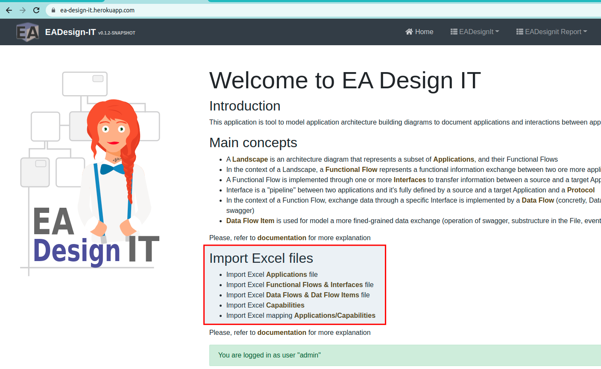
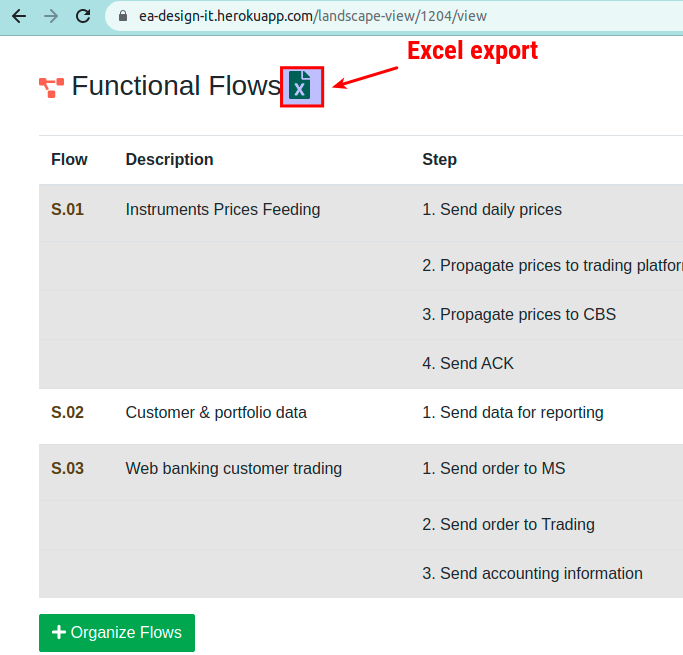

# Import Excel to feed your database

A convenient way to populate your database is importing your landscape via Excel File.

Here an example of file for :
 - importing [Application via Excel](./samples/applications.xlsx)
 - importing [Landscape via Excel](./samples/Invest_And_Securities_Landscape.xlsx)

# Exporting Excel from EADesignIt

You also can export Excel directly from the application.

# Excel format mapping

Find below the mapping between Excel column name and Entities field names

## Application Excel - columns mapping

| Excel Column Name            | FlowImport setter | Application setters
|------------------------------|----------------|-------|
| application.id               | setIdFromExcel | setId |
| application.name             | setName        | setName |
| application.description      | setDescription | setDescription |
| application.comment          | setComment     | setComment  |
| application.type             | setType        | setType |

## Flow Excel columns - mapping 

| Excel Column Name            | FlowImport setter            | functionalFlow setter | FlowInterface setters | DataFlow  |
|------------------------------|------------------------------|-----------------------|-----------------------|-----------|
| Id flow                      | setIdFlowFromExcel           |                       | setId | |
| Alias flow                   | setFlowAlias                 | setId                 | | |
| Source Element               | setSourceElement             |                       | setSource | |
| Target Element               | setTargetElement             |                       | setTarget | |
| Description                  | setDescription               | setDescription        | | |
| Integration pattern          | setIntegrationPattern        |                       | setProtocol | |
| Frequency                    | setFrequency                 |                       | | |
| Format                       | setFormat                    |                       | | |
| Swagger                      | setSwagger                   |                       | | |
| Blueprint From Source        | setSourceURLDocumentation    |                       | | |
| Blueprint From Target        | setTargetURLDocumentation    |                       | | |
| Status Blueprint From Source | setSourceDocumentationStatus |                       | | |
| Status Blueprint From Target | setTargetDocumentationStatus |                       | | |
| Status flow                  | setFlowStatus                | setStatus             | | |
| Comment                      | setComment                   | setComment            | | |

| Excel FileName    | FlowImport setter  | Object setters               |
|-------------------|--------------------|------------------------------|
| file name         |                    | landscapeView.setDiagramName | 