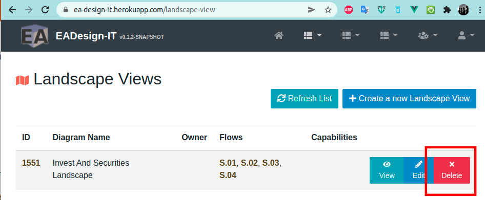

# Import Excel - Templates & Samples

A convenient way to populate your database is importing your landscape via Excel File.

Here an example/templates of files for :
 - importing [Application via Excel](./samples/applications.xlsx)  - sheet named "*Application*"
 - importing [Landscape via Excel](./samples/Invest_And_Securities_Landscape.xlsx) - sheet named "*Message_Flow*"
 - importing [Data & Data Items via Excel](./samples/data-data-item.xlsx) - sheet named "*Data*" and "*DataItem*"
 - importing [Capabilities & sub-capabilities](./samples/capabilities.xlsx) - sheet named "*Capabilities*"
 - importing [Mapping between Capabilities & Applications](./samples/capabilities-applications.xlsx) - all sheets with a name "*ADD_XXX*"

# How to import
## How to find the URLs?

If you have enough access, you will have different links to import Excel files on the Home page.

> Importing en Excel file requires **ROLE_WRITE** access

## Import an existing Landscape

For importing an existing Landscape, you should first delete the existing Landscape, then import it via the new Excel file. 

 
> Deleting a entity requires **ROLE_HARD_DELETE** access

**During Landscape deletion, orhpan entities (FunctionalFlow, Interface, DataFlow, DataFlowItem) not used in another landscape will be deleted.** 

