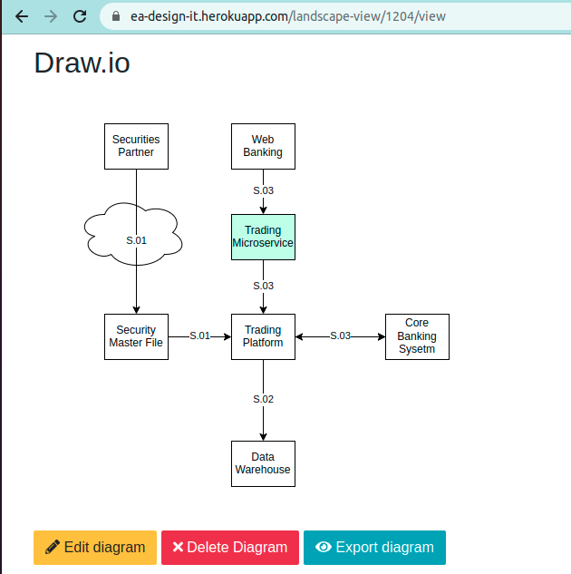

# EADesignIt

# Introduction

EADesignIt is a lightweight open source Enterprise Architecture software that allows to create transaparency on your assets, their connections and their characteristics. This tool aims Enterprise Architects who need to document the state of their enterprises by helping them to describe their applications landscape with a minimal effort. Its purpose is to replace unmaintanable Excel files by a database repository.

You can discover EADesignIt featutes browsing the [demo on Heroku platform](https://ea-design-it.herokuapp.com/).

# Product philosophy

Based on the observation that building an enterprise-wide assets repository is a costly activity and that maintaining a fine-grained refential manually could turn into a nightmare, the idea behind EADesignIt is to offer the possibility to complete a high-level top-down process by a more automatic-feeding bottom-up approach.

That's why, event if it's possible to create all entities (applications, interfaces, etc.) via the GUI, the philosophy of the software is to offer an excel import/export mechanism as a first-class citizen feature.

For the same reason, offering an API over the database to add custom process/tools to populate the database is an essential part of the solution.

# Data model

EADesignIt helps architects to document their assets, including:

- Applications,
- Application Components,
- Interfaces,
- Functional Flows,
- Data Flows,
- and Applications Capabilities.

If you want to know if EADesignIt is appropriate in your context, the most important aspect is to know if the data model could meet your requirements. To achieve this, please read the [description of data model](./metamodel/metamodel.md). You can also consult the [JDL file](https://github.com/mauvaisetroupe/ea-design-it/blob/main/jhipster-jdl-metamodel.jdl) for a more accurate and detailed view of the entities and their relationships (you can use [jdl studio](https://start.jhipster.tech/jdl-studio/) and import JDL file).

# Diagramming or not diagramming?

This application is not an architeture diagram tool. It should preferably be considered as a database repository.

Diagram capabilities come however in two forms.

## PlantUML

EADesignIt uses [plantuml](http://www.plantuml.com) for real-time visualization. It generates an UML components diagram to expose applications and their integrations.

Example of generated plantuml diagram :

## Drawio

EADesignIt also generates editable diagram using [drawio](https://drawio-app.com/). Like the one generated on-the-fly with plantuml, this schema represents applications and their interfaces. But with this drawio feauture, you can also easily edit and customize the generated schema and save it in your database.

If you add a new application in your landscape, EADesignIt will add this additional component in your drawio landscape diagram without loosing the formatting you've previously done.

Example of generated and editable draw.io diagram :

# Demo

You can find a [demo on Heroku platform](https://ea-design-it.herokuapp.com/).

# Build the application

This application is build with Java, Spring Boot and VueJS.

It's based on JHipster to generate all entities. Please refer to [documentation](./jhipster/README.md).
