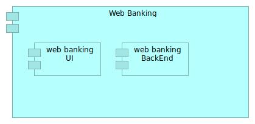

# Application 

## Teminology 

What is an application ? There is no general and satisfactory answer to this question. You need define your own abstraction in order to have a high-level view of your landscape. 

Archimate 3.1{: .label .label-blue } There is no definition of an Application in Archimate

A pragmatic approach is to decide that an Application is an homogenous set of **Application Components** seen as one from an external point of view with defined interfaces to other systems.
With this definition, an application describes the software used in a company from a functional point of view and that supports the business with their functions and capabilities . 

## Example

In a bank for example, an Application could be the web banking. Customers use the web banking as their main bank application. 

# Application Component

## Teminology 

Archimate 3.1{: .label .label-blue } An application component represents an encapsulation of application functionality aligned to implementation structure, which is modular and replaceable.

Archimate 2.1{: .label .label-blue } An application component is defined as a modular, deployable, and replaceable part of a software system that encapsulates its behavior and data and exposes these through a set of interfaces.

## Example

In the above web banking example, from DEV & IT-OPS teams perspective, web bankink application is decomposed into in 3 ou 4 different Application Components separately deployable, that together create the web banking application

# Corresponding Archimate diagram

Archimate 3.1{: .label .label-blue } An application is composed of Application Component. This is usually modeled with an application Structure Diagram

