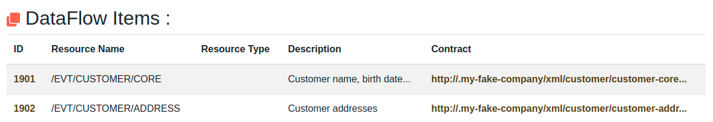
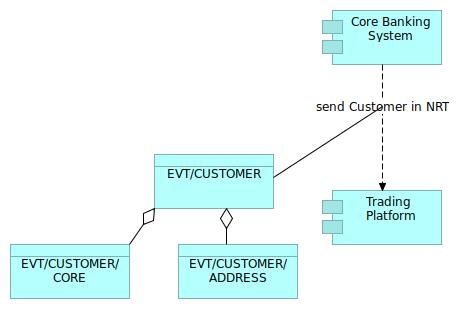

# DataFlowItem

## Teminology 

DataFlowItem is used for model a more fined-grained data exchange.

We could follow for example the following convention :

| Protocol               | DataFlow                             | DataFlowItem
|------------------------|--------------------------------------|-------------
| API                    | A service exposed through a Swagger  | An operation of the service
| File                   | A fhysical File                      | A substructure in the File
| Event                  | A topic                              | An Event in the topic

## Example 

Data flow (topic /EVT/CUSTOMER) is used by two Data Flow Item (typically Kafka Events) : 
 - A DataFlowItem (typically Kafka Event) EVT/CUSTOMER/CORE for Customer name, birth date...
 - A DataFlowItem (typically Kafka Event) EVT/CUSTOMER/ADDRESS for Customer address

# Corresponding Archimate Diagram

Archimate 3.1{: .label .label-blue } A Data Flow Item is modeled with a Archimate Data Object.
There is an aggregation or composition relationship between Dat Flow and Data Flow Items

