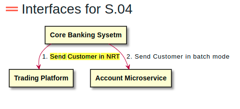
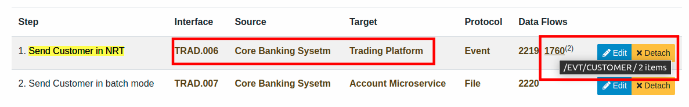
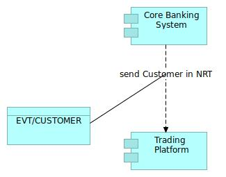

# DataFlow

## Teminology 

In the context of a Function Flow, exchange data through a specific Interface is implemented by a **DataFlow** 

Typically, a DataFlow is implemented by one of the many data carriers, including:
- **Files**, 
- **Event** streams 
- **API** calls
- **Message** queues
- **CORBA** calls
- Etc.

A DataFlow belongs to a distinct Interface, hence Interfaces and related DataFlows share the same owner. 

Usually, a DataFlow corresponds directly to one technical element like e.g. a particular event stream. This element can be modeled with a [Data Flow Item](../data-flow-item). However, it may happen that a second level of description is needed for your data exchange. An example would be if it happens that different types of events are carried in a single event stream. For this cases, a one-to-many relationship has been provided to [Data Flow Item](../data-flow-item). 

## Example

FunctionalFlow "Customer Synchronization" is implemented through two 
Interfaces :
 - TRAD.006, an Event synchronization between Core Banking Sysetm and Trading Platform
 - TRAD.007, a Batch file synchronization between Core Banking Sysetm and an Account Microservice
 

Interface TRAD.006 is implemented with a DataFlowItem (typically a topic in a streaming platform like Kafka or others) : /EVT/CUSTOMER
 

# Mapping with Archimate specification

A Data Flow is modeled with a Archimate **Data Object.**

Archimate 3.1{: .label .label-blue } A data object represents data structured for automated processing.

Data Flow could appear on **Application Cooperation Viewpoint** :

