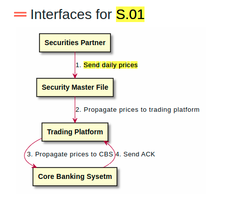
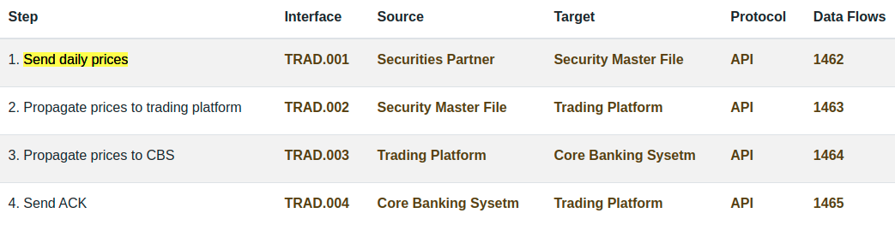

# Functional Flow

## Teminology 

In the context of a **Landscape**, a Functional Flow represents a functional information exchange between two or more applications

FunctionalFlow is a list of **steps**, each step leverages on an [Interface](../interface)

## Example

**S.01** is FunctionalFlow that describes interactions between applications for "Instruments Prices Feeding".

It is composed of 3 steps :
- Securities Partner send prices to Trading Platfom via the Security Master File
- Trading Platform synchronize the prices to the Core Banking Sysetm
- Core Banking Sysetm confirm the reception of prices to the Trading Platform

# Corresponding Archimate Diagram

Basically, a Functional Flow is nothing more than a subset of Landscape, representing a specific usage of the landscape in a specific functional use case. 

Archimate diagram is then the same than the one used for Landsacpe

Archimate 3.1{: .label .label-blue } Functional Flow could be modeled in Archimate with a cooperation viewpoint using :
 - Application Components
 - Flow Relationship 

