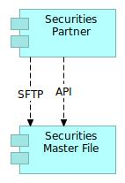

# Interfaces

## Teminology 

Interface is a "pipeline" between two [Applications](../application/) and it's fully defined by :
- a source **Application**
- a target **Applications**
- a protocol (API, Files, Events, etc.)

A **Functional Flow** is implemented through one or more **Interfaces**.

On the other hand, an **Interface** could be used to implement different **Functional Flows**, even in different Landscapes.

Interface has a unique owner (a DEVOPS team that develop & opearate the integration)

Data that go through an Interface piepeline is named [Data Flow](../data-flow)

## Example 

A single Functional Flow (Instrument prices   ) could be implemented 
trough two different Interfaces:
 - an REST API between Securities Partner and Security Master File
 - an REST API between Security Master File and Trading Platform
 - etc.

# Corresponding Archimate Diagram

As explained in [this article](https://bizzdesign.com/blog/practical-archimate-viewpoints-for-the-application-layer/), you could model your flow relationship in different manner:
 1. Adding one flow relationship for each data object. That choice gives the option to add properties like exchange frequency, format and other details, but that choice can also lead to very complex diagrams. 
 2. Create only one flow relationship per technology interface

With the opiniated choice described above (an interface is a pipeline between a source, a target for a specific protocol - or technology interface, we are clearly in the second option.

Information concerning frequency, format and other are stored at [Data Flow](./metamodel-data-flow.md) level.

