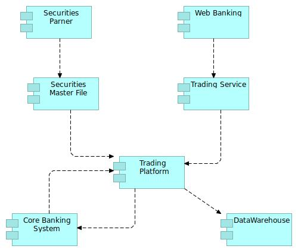

# Teminology 

## Landscape Viewpoint
IT lanscape, composed by hundred of applications and components is difficult to model. A single and comprehensive model is often too complex to be understood. 

That's why it's important to introduce views and viewpoints.

Using TOGAF terminology, A **view** is a representation of a whole system from the perspective of a related set of concerns. A **viewpoint** defines the perspective from which a view is taken. Viewpoint a kind of template, and View is an instantiation of a a specific viewpoint

This first version of the tool implement a unique ViewPoint : Application **Landscape**

Archimate 3.1{: .label .label-blue } Architecture View - A representation of a system from the perspective of a related set of concerns. 

Archimate 3.1{: .label .label-blue } Architecture Viewpoint- A specification of the conventions for a particular kind of architecture view. 

## Example

A Landscape is a set of [Functional Flow](../functional-flow/) that together gives for example a big picture of specific domain.

In this example, Landscape in composed of 3 Functional Flows : **S01**{: .bg-yellow-000 }, **S02** et **S03**

# Corresponding Archimate diagram

Archimate 3.1{: .label .label-blue } An application landscape could be modeled in Archimate with a cooperation viewpoint ([see explanations](https://bizzdesign.com/blog/practical-archimate-viewpoints-for-the-application-layer/)) using :
 - Application Components
 - Flow Relationship 

