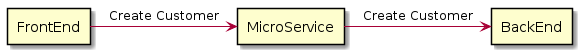
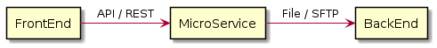
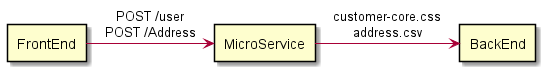
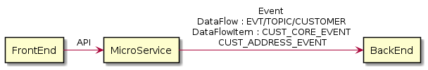

# Introduction
This application is tool to model application architecture building diagrams to document applications and interactions between applications (data flows).

# Teminology 

## Viewpoint
IT lanscape, composed by hundred of applications and components is difficult to model. A single and comprehensive model is often too complex to be understood. 

That's why it's important to introduce views and viewpoints.

Using TOGAF terminology, A **view** is a representation of a whole system from the perspective of a related set of concerns. A **viewpoint** defines the perspective from which a view is taken. Viepoint a kind of template, and View is an instantiation of a a specific viewpoint

This first version of the tool implement a unique ViewPoint : Application **Landscape**

## Application and Application Components
What an application is? There is no obvious reponse. But anyway, you need a abstraction in order to have a high-level view of your landscape. A pragmatic approach is to decide that an Application is an homogenous set of Application Components seen as one from an external point of view. 

 

> In a bank for example, an Application could be the web 
> banking. Customers use the web banking 
> as their main bank application. 
> From DEV & IT-OPS teams perspective, web bankink application 
> is decomposed into in 3 ou 4 different Application Components
> separately deployable, that together create the web banking 
> application

## Functional Flows

In the context of a **Landscape**, a Functional Flow represents a functional information exchange between two or more applications

 

> FrontEnd component need to push data to its BackEnd, 
> through a Microservice for creating a new customer. 
> This is a 'createCustomer' functional flow.
>
> 

FunctionalFlow is a list of **steps**, each step leverages on an **Interface**

## Interfaces

A Functional Flow is implemented through one or more **Interfaces** to transfer information between source and target.

Interface is a "pipeline" between two applications and it's fully defined by :
- a source **Application**
- a target **Applications**
- a protocol (API, Files, Events, etc.)

 

> A single Functional Flow (createCustomer) could be implemented 
> trough two different Interfaces:
> - an REST API between FrontEnd and Microservice
> - an SFTP file transfer between Microservice et Backend
>
> 

 

On the other hand, an Interfcae could be used to implement different Functional Flows, even in different Landscapes.

But an Interface has a unique owner (a DEVOPS team)

## DataFlow

In the context of a Function Flow, exchange data through a specific Interface is implemented by a **DataFlow** 

Concretly, DataFlow is one of the following artifact:
- a **File**, 
- an **Event** 
- or **API**

 

> FunctionalFlow createCustomer is implemented trhough two 
> Interfcaces, and then via multiple DataFlow transfer in each 
> Interface :
> - two API call between FrontEnd and MicroService
> - then by SFTP transfer with many Files (customer-core.cvs &  address.csv) between MicroService and BackEnd
> 
> 

 

A dataflow if implemented through an Interface, hence dataflow ownership is define by Interface owner.

## DataFlowItem

DataFlowItem is used for model a more fined-grained data exchange
We could follow for example the following convention :

| Protocol               | DataFlow                             | DataFlowItem
|------------------------|--------------------------------------|-------------
| API                    | A service exposed through a Swagger  | An operation of the service
| File                   | A fhysical File                      | A substructure in the File
| Event                  | A topic                              | An Event in the topic

> FunctionalFlow createCustomer is implemented with 
> Interfcace between MicroSercie and BackEnd
> - DataFlow is of type Event, and it's a topic (typically Kafka topic), named for exampe /EVT/TOPIC/CUSTOMER
> - In the topic, we have 2 Events (CUST_CORE and CUST_ADDRESS)
> 
> 

# Meta-Model

Here is the meta-model used in the tool.

# JHipster JDL

You can also import the [JDL file](/jhipster-jdl-metamodel.jdl) in [jdl studio](https://start.jhipster.tech/jdl-studio/) for a more accurate and detailed view of the entities and their relationships.

