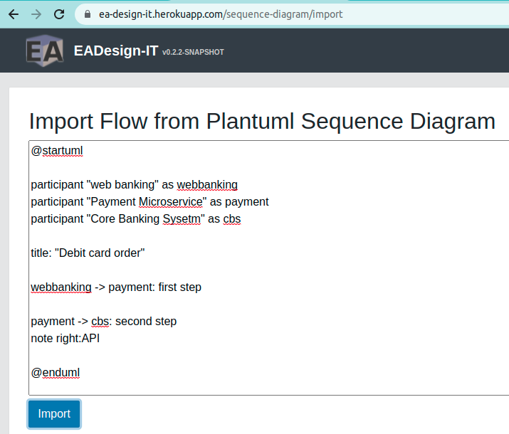
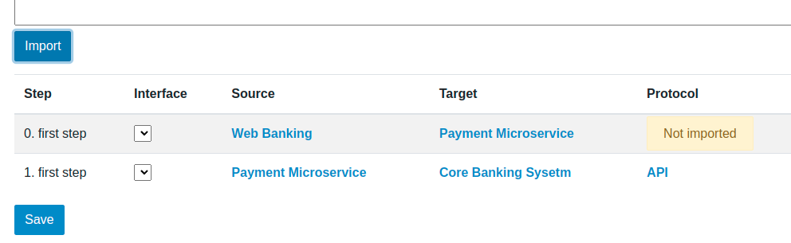

# Import Plantuml - FunctionalFlow

A convenient way to import a Functional Flow is using plantuml
You can describe your Functional Flow as a Sequence Diagarm



```
@startuml
participant "web banking" as webbanking
participant "Payment Microservice" as payment
participant "Core Banking Sysetm" as cbs
title: "Debit card order"
webbanking -> payment: first step
payment -> cbs: second step
note right:API
@enduml
```

