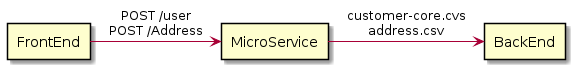
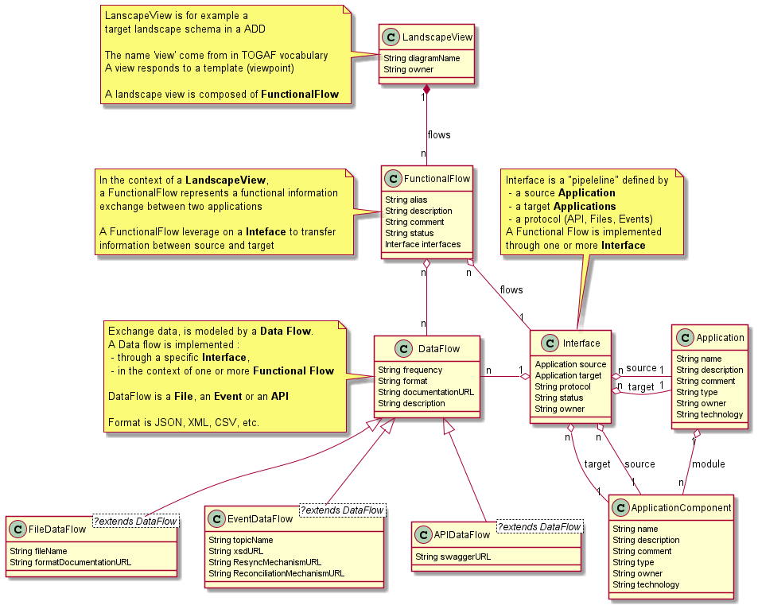

# Introduction
This application is about have a cartography of your applications eand flows between applications

# Teminology 
In order to undurstand the metamodel of this tool, let's share the same language.

## Viewpoint
IT lanscape, composed by hundred of application components is difficult to model. A single and comprehensive model is often too complex to be understood. That's why it's important to introduce viewpoints.

Using TOGAF terminology, A **view** is a representation of a whole system from the perspective of a related set of concerns. A **viewpoint** defines the perspective from which a view is taken

This first version of the tool implement a uniqeu ViewPoint : Application **Landscape**

## Application and Application Components
What an application is? There is no obvious reponse. But anyway, you need a abstraction in order to have a high-level view of your landscape. A approach is to decide that an Application is an homogenous set of Application Components seen as one from an external point of view. 

In a bank, an Application is for example you web banking. Outside de DEV & IT-OPS teams, no importance to decompose it in 3 ou 4 different Application Components. But inside the team, your components are deployable components that together creat your application

## Functional Flows

In the context of a **Landscape**, a Functional Flow represents a functional information exchange between two applications

```
FrontEnd component need to push data to its BackEnd, 
through a Microservice for creating a new customer. 
This is a 'Create Customer' functional flow.
```


## Interfaces

A Functional Flow is implemented through one or more **Interface** to transfer information between source and target.

Interface is a "tuyau" and it's fully defined by :
- a source **Application**
- a target **Applications**
- a protocol (API, Files, Events, etc.)


```
A single Functional Flow (createCustomer) could be implemented trough two different Interfaces:
- an REST API between FrontEnd and Microservice
- an SFTP file transfer between Microservice et Backend
```


## DataFlow

In the context of a Function Flow, exchange data through a specific Interface is implmented by **DataFlow** (**File**, **Event** or **API**). 


```
FunctionalFlow createCustome is implemented trhough two Interfcaces, and then via multiple DataFlow transfer in each Interface :
- two API call between FrontEnd and MicroService
- then by SFTP transfer with many Files (customer-core.cvs & address.csv) between MicroService and BackEnd
```




# Meta-Model




